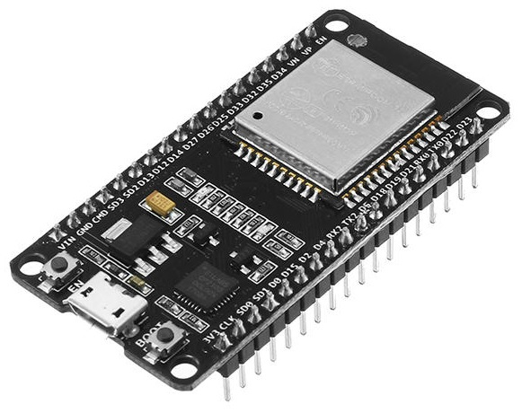

# ESP32 på devkit v1 från DOIT
Först, varför publicerar jag detta? -Jo, för att just de billiga (55 SEK på t.ex. Banggood) ESP-WROOM-32 utvecklingskorten från t.ex. Banggood.com verkar vilja sälja bort en serie utvecklingskort till förmån för nya serier eller så rör det sig om piratkopierade utvecklingskort med äkta ESP-chip.

## Vad skiljer?
Det billiga utvecklingskortet märkt "ESP32 DEVKIT V1 DOIT" har 2x18 pinout (36pin) är _obefintligt_ dokumenterat på Internet/Banggood/DOIT. Det kortet som har 2x15 (30-pin) är väldokumenterat. Båda utvecklingskorten bär ett ESP-WROOM-32 chip som är väldokumenterat. Problemet med det odokumenterade kortet diskuteras bl.a som ett issue på Github https://github.com/espressif/arduino-esp32/issues/544 senast 3 mars 2018 och på banggood https://forum.banggood.com/forum-topic-258596.html?page=2. 

## Pin out/Pin map
Problemet handlar om mappningen mellan _pinout_ (anslutningspinnarna till kortet) och ESP32-pinnarna på chipet.

## Pinout - 2x15 pins versionen
Lägg märke till att andra pinnen till höger på 2x15 kortet också är GND medan på 2x18 kortet är det CLK.

## Pinout - 2x18 pins versionen från bl.a. Banggood
Lägg märke till att andra pinnen till höger på 2x15 kortet också är GND medan på 2x18 kortet är det CLK. Det är också större avstånd mellan de diskreta komponenterna och ESP-chipet.

### Hanteringen av pinnarna
Avkodning av samtliga pinnar på 2x18pins versionen.

## ESP32 - ESP-WROOM-32?
ESP32 är chipet från Espressif. ESP-WROOM-32 är modulen som chipet sitter på.

Dokumentationen delas upp i två delar
1. Tech spec på ESP32
2. Tech spec på DevKit V1 från DOIT

## Block Diagram

